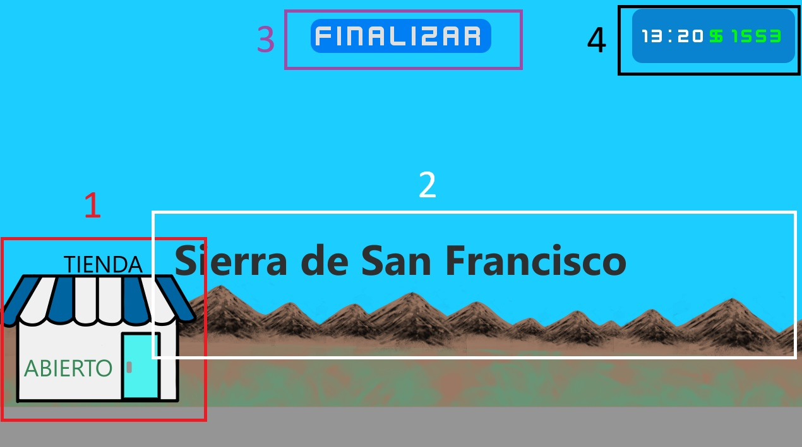
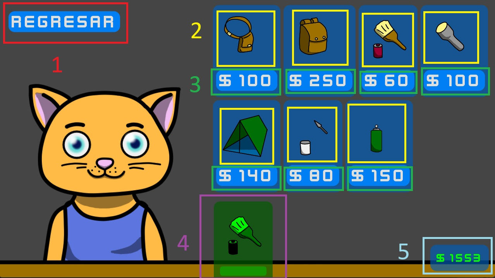
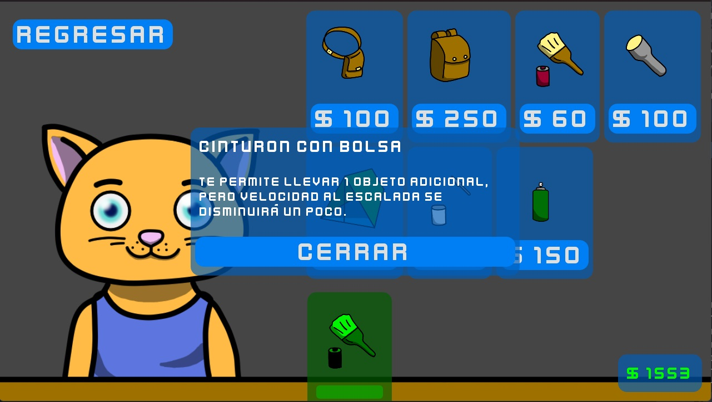
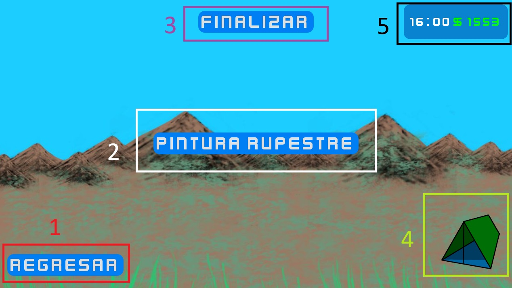

# Manual

1. [Cómo jugar](#1-cómo-jugar)  
    1.1 [Plataformas](#11-plataformas)
   - [Navegador web](#111-navegador-web)
   - [Windows](#112-windows)
   - [Linux](#113-linux)
   - [Android](#114-android)

    1.2. [Controles](#12-controles)  
    1.3. [Acciones](#13-acciones)  
2. [Pantallas del juego](#2-pantallas-del-juego)  
2.1 [Pantalla 1](#21-pantalla-1)  
2.2 [Pantalla 2](#22-pantalla-2)  
2.3 [Pantalla 3](#23-pantalla-3)  
2.4 [Pantalla 4](#24-pantalla-4)

3. [Objetos](#3-objetos)  

4. [Extra: Modificar el videojuego](#4-modificar-el-videojuego)  
4.1 [Descargar proyecto](#41-descargar-proyecto)  
4.2 [Descargar Godot](#42-descargar-godot)  
4.3 [Estructura del proyecto](#43-estructura-del-proyecto)

5. [Acerca de](#5-acerca-de)  
5.1 [Licencias](#51-licencias)

## 1. Cómo jugar

### 1.1. Plataformas
#### 1.1.1 **Navegador web** 
Ir a [itch.io](https://m0g1wara.itch.io/el-gato-restaurador) y dar click en el botón "Run Game".

#### 1.1.2 **Windows** 
Ir a [itch.io](https://m0g1wara.itch.io/el-gato-restaurador) y descargar el archivo ejecutable "El Gato Restaurador.exe" con el botón "Download".

#### 1.1.3 **Linux** 
Ir a [itch.io](https://m0g1wara.itch.io/el-gato-restaurador) y descargar el archivo ejecutable "El Gato Restaurador.x86_64" con el botón "Download".

#### 1.1.4 **Android** 
Ir a [itch.io](https://m0g1wara.itch.io/el-gato-restaurador) y descargar el archivo ejecutable "El Gato Restaurador.apk" con el botón "Download".

### 1.2. Controles
Se utiliza el botón izquierdo del mouse para interactuar.
Se puede utilizar el botón central/scroll del mouse para cambiar entre objetos si se tiene mas de uno.

### 1.3. Acciones
Los objetos tienen durabilidad

Cuando la barra se agote, el objeto se romperá y no podrás usarlo.

## 2. Pantallas del juego
### 2.1. Pantalla 1
Muestra una tienda y a lo lejos la sierra de San Francisco, arriba a la izquierda se muestra la hora del juego y el dinero que tiene el jugador.

1. Botón Tienda, le permite al jugador ir a la Pantalla 2.
2. Botón Sierra de san Francisco, le permite al jugador ir a la pantalla 3.
3. Botón finalizar, le permite al jugador finalizar la partida en cualquier momento y obtener su puntuación.
4. Muestra la hora dentro del videojuego y el dinero restante.

### 2.2. Pantalla 2
Muestra la tienda donde el jugador puede comprar objetos.

1. Botón Regresar, le permite al jugador ir a la Pantalla 1 
2. Botón imagen del objeto, le permite al jugador ver los detalles del objeto.

3. Botón precio del objeto, le permite al jugador comprar el objeto si tiene espacio y dinero suficiente.
4. Hotbar, lista los objetos que tiene el jugador así como su durabilidad.
5. Muestra el dinero restante.

### 2.3. Pantalla 3
Muestra una tienda de campaña y la sierra de San Francisco.

1. Botón Regresar, le permite al jugador ir a la Pantalla 1. 
2. Botón Pintura rupestre, le permite al jugador ir a la pantalla 4.
3. Botón finalizar, le permite al jugador finalizar la partida en cualquier momento y obtener su puntuación.
4. Botón tienda de campaña, le permite al jugador pasar la  noche si compro la tienda de campaña en la tienda.
5. Muestra la hora dentro del videojuego y el dinero restante.

### 2.4. Pantalla 4
Muestra una pintura rupestre que debe ser restaurada

1. Hotbar, lista los objetos que tiene el jugador así como su durabilidad.
2. Botón Regresar, le permite al jugador ir a la Pantalla 3.
3. Botón finalizar, le permite al jugador finalizar la partida en cualquier momento y obtener su puntuación.
4. Muestra la hora dentro del videojuego y el dinero restante.

## 3. Objetos
Al iniciar el juego se asigna una cantidad aleatoria de dinero al jugador para comprar objetos.
Todos los objetos se compran en la tienda(Pantalla 2).

| Identificador | Nombre               | Descripción                                                                             | Precio |
|---------------|----------------------|----------------------------------------------------------------------------------------|--------|
| 0             | Cinturón con bolsa   | Te permite llevar 1 objeto adicional, pero velocidad al escalada se disminuirá un poco |100     |
| 1             | Mochila grande       | Te permite llevar 3 objetos adicionales, pero disminuirá tu velocidad al escalar       |250     |
| 2             | Disolvente y brocha  | Te permite limpiar la pintura de las paredes                                           |60      |
| 3             | Linterna             | Te permite ver en las noches                                                           |100     |
| 4             | Tienda de campaña    | Te permite dormir por las noches                                                       |140     |
| 5             | Resanador de grietas | Te permite restaurar las grietas de la piedra                                          |80      |
| 6             | Pintura en aerosol   | Algunas personas lo usan para dañar las pinturas rupestres                             |150     |

## 4. Modificar el videojuego

### 4.1. Descargar proyecto
Para descargar el código fuente del videojuego se debe ir al [repositorio del proyecto](https://github.com/M0G1WARA/El-gato-restaurador/).
Dar click en el botón verde "code" y después click al botón "Download ZIP"

Una vez descargado debes descomprimir el archivo, si estas usando windows 11 puedes dar click derecho y "Extraer todo..". 

Si no tienes un programa para descomprimir puedes descargar [7-zip](https://7zip-es.updatestar.com/download.html).

### 4.2. Descargar Godot
Para poder abrir el proyecto es necesario Godot.

Godot esta disponible para Android, Linux, macOS, Window.

Recomendado descargar [Godot 4.2.2 ](https://godotengine.org/download/archive/4.2.2-stable/) dando click en el botón azul "Standard".

Alternativas:
- [Descargar desde itch.io ](https://godotengine.itch.io/godot)
- [Descargar desde su pagina oficial](https://godotengine.org/)
- [Descargar desde Google Play Store ](https://play.google.com/store/apps/details?id=org.godotengine.editor.v4)
- [Descargar desde Steam ](https://store.steampowered.com/app/404790/Godot_Engine/)
- [Descargar desde Epic Games Store ](https://store.epicgames.com/es-MX/p/godot-engine)

Una vez descargado, abrir Godot dar click en "importar" y seleccionar la carpeta descomprimida del proyecto.

Cuando abra el proyecto puedes abrir la carpeta Scenes/ y buscar los archivos **.tscn** para empezar a modificar las escenas y los archivos **.gd** para modificar el codigo.

### 4.3. Estructura del proyecto
- **Assets/Images**: Contiene las imágenes utilizadas.
- **Docs**: Contiene el GDD y este Manual.
- **Fonts**: Contiene la tipografía utilizada.
- **Global**: Contiene las variables globales de los objetos(precio, nombre, descripción, capa en la que interacciona, durabilidad), y los objetos que el jugador a comprado.
- **Particles/PaintParticles2D**: Contiene la escena de las partículas que salen al utilizar "Disolvente y brocha".
- **Resources/theme.tres**: Contiene los estilos del proyecto como lo son color del botón, tipografía, color del panel, etc.
- **Scenes**: contiene todas las escenas utilizadas separadas por carpetas.

## 5. Acerca de
- El proyecto fue hecho en Godot 4.2.2 para la Mini Game Work Jam: Conservación del Patrimonio Gráfico Rupestre
- Las imágenes fueron hechas por mi con el programa Krita.
- La tipografía es de [Kenney Fonts ](https://kenney.nl/assets/kenney-fonts)

### 5.1 Licencias
- Imágenes - Creative Commons CC0
- Código - Creative Commons CC0
- Tipografía - Creative Commons CC0
